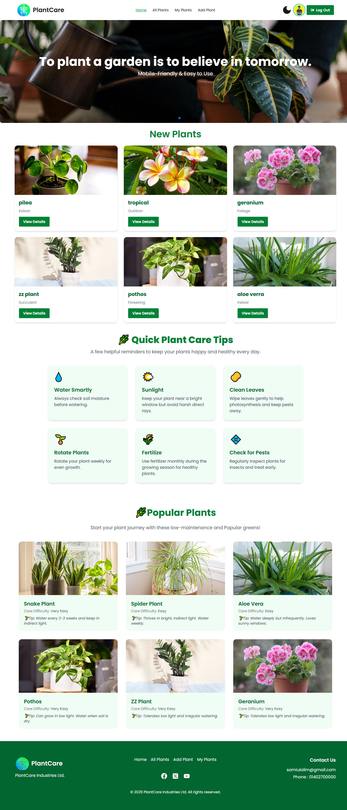
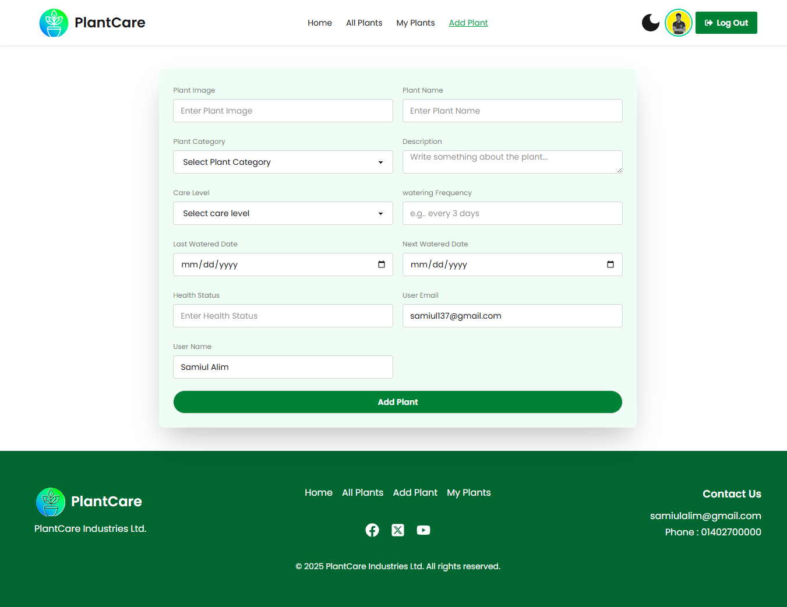
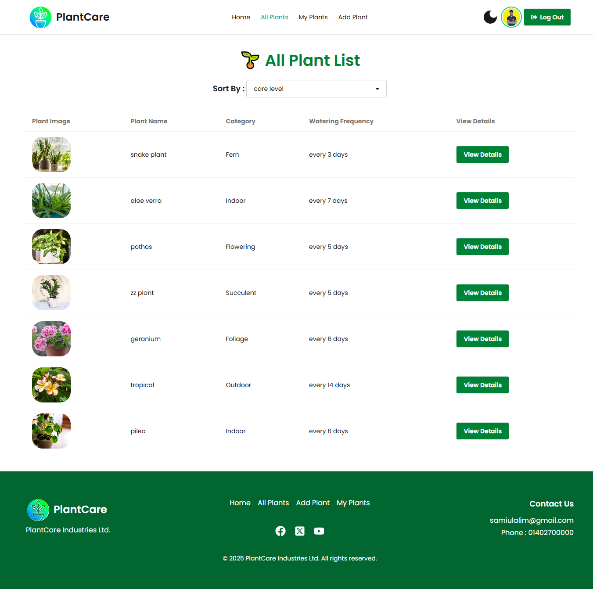
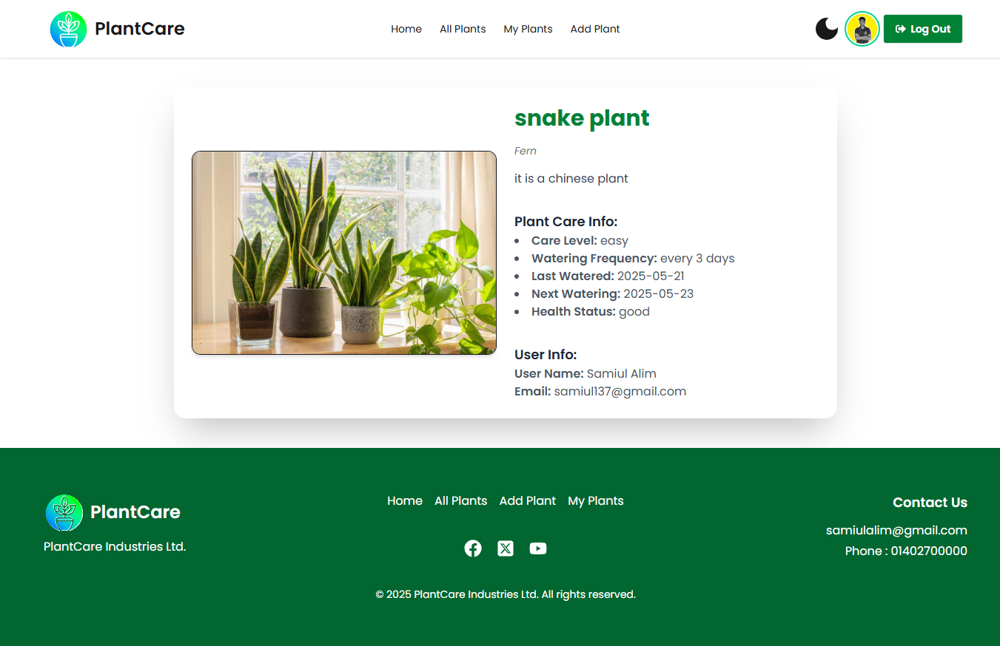

# 🌿 PlantCare - Smart Plant Management System

**Live Site:** https://plant-tracker-web-app.netlify.app/

PlantCare is a smart plant management web application where users can keep track of their plant care activities, explore plant information, and add new plants with personalized details.

---

## 🔥 Key Features

- ✅ **Add Plant Info** — A form to add plant name, image, care level, category, and more.
- 🌱 **Plant List Table** — Displays all plant entries in a table format with a "View Details" button.
- 📅 **Soty By** — sort plant by care level (e.g. easy,difficult,moderate).
- 📚 **Quick Plant Care Tips** — Includes plant care tips, seasonal guides, and popular beginner-friendly plant suggestions.
- 🪴 **User-Based Plant Records** — Each plant is associated with the user who added it.
- 💡 **New Plants section** —with at least 6 last added plant cards and a "View Details" button..

---

## 🚀 Technologies Used

- React.js
- Node js
- Tailwind CSS
- DaisyUI
- Swiper.js
- Firebase Authentication
- MongoDB + Express
- React toastify + sweet alert

---

## 🚀 Run Locally

To run this project on your local machine, follow these steps:

1. **Clone the repository**

git clone: https://github.com/samiulalim-dev/plant-tracker-client.git

2. **Navigate to the project directory**
- **cd plant-tracker**
3. **Install dependencies**
- **npm install**
4. **Start the development server**
- **npm run dev**
4. **Open your browser and visit**
- **http://localhost:5173**

## 📸 Screenshots

### 🌿 Home Page

### 📝 Add Plant Page

### 📋 Plant List

### 🔍 Plant Details

## Developed by: [Samiul Alim]

📧 Email:samiul@alim.com
